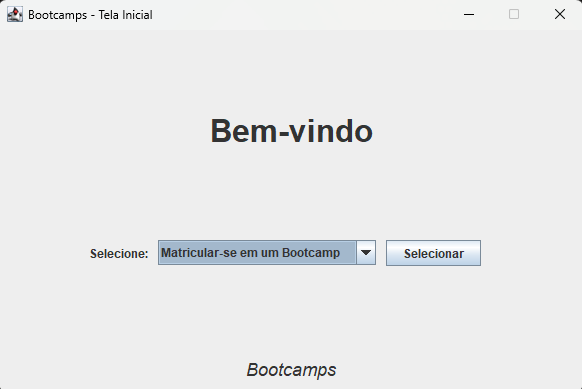

  
# Abstraindo um Bootcamp Usando Orientação a Objetos em Java

### Desafio de projeto - [Bootcamp GFT Start #7 Java - DIO](https://www.dio.me/bootcamp/gft-start-7-java) 

---

### Desenvolvimento

Com base nas aulas e no repositório original citado, foi desenvolvida uma aplicação que, com base
em um domínio modelado durante as aulas, implementou mais conceitos de Programação Orientada a Objetos,
padrões e interface gráfica (Java Swing e AWT).

Ao final, tem-se uma aplicação Java com interface gráfica que simula uma plataforma de Bootcamps, 
onde é possível se matricular, consultar informações sobre eles, progredir, e até ver o ranking 
composto por outros estudantes (no caso, são mocks).

--- 

---

#### Repositório original: [https://github.com/cami-la/desafio-poo-dio](https://github.com/cami-la/desafio-poo-dio)
